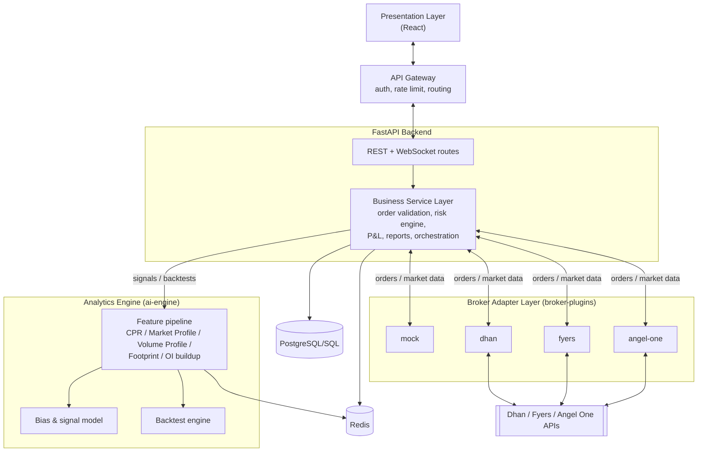
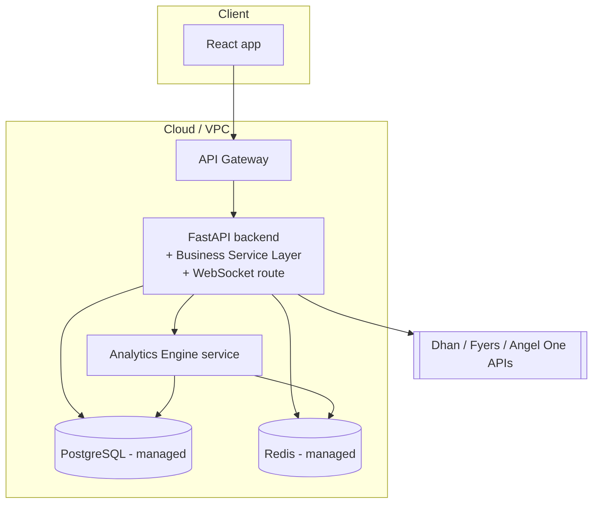

# Architecture — NiftyEdgeAI

**Version:** 0.2 (stack decided)

## 1. Overview

NiftyEdgeAI is a layered architecture, top to bottom:

```
Presentation Layer (React)
           │
      API Gateway
           │
      FastAPI Backend
           │
 Business Service Layer
           │
   Analytics Engine
           │
 Broker Adapter Layer
           │
  Dhan / Fyers / Angel One
           │
   PostgreSQL/SQL + Redis
```

Mapped onto the repo:

- **Presentation Layer (React)** → `frontend/` — currently a static HTML/CSS/JS prototype; the target implementation is a React SPA (see `frontend/README.md`).
- **API Gateway** → single public entry point in front of the backend. Terminates TLS, authenticates requests (JWT validation), rate-limits, and routes to the FastAPI backend (and to the WebSocket gateway for realtime). Provisioned in `infrastructure/`.
- **FastAPI Backend** → `backend/` — the HTTP/WebSocket API surface (see `docs/API/API.md`). Thin: request validation, auth, response shaping.
- **Business Service Layer** → `backend/services/` — the actual domain logic behind the API: order validation, risk-limit enforcement, position/P&L calculation, report generation, orchestration of calls to the Analytics Engine and Broker Adapter Layer. The FastAPI layer stays thin and delegates here.
- **Analytics Engine** → `ai-engine/` — CPR/Market Profile/Volume Profile/Footprint/OI feature computation, the AI Market Bias and Strategy Signal model, and the backtesting engine.
- **Broker Adapter Layer** → `broker-plugins/` — normalizes order placement and market data across brokers behind one common interface.
- **Dhan / Fyers / Angel One** → the three brokers targeted for v1 integration, each as its own adapter under `broker-plugins/`.
- **PostgreSQL/SQL + Redis** → the datastore layer: Postgres for durable relational data (users, orders, positions, signals — see `docs/ERD/ERD.md`), Redis for live quote/option-chain caching, WebSocket fan-out, and rate limiting. Accessed by the Business Service Layer and the Analytics Engine.

Only the API Gateway is public; everything below it (FastAPI backend, Business Service Layer, Analytics Engine, Broker Adapter Layer, datastores) lives inside the private network. The Presentation Layer never talks to a broker, the Analytics Engine, or the datastores directly — the API Gateway → FastAPI Backend path is the only way in, which keeps broker credentials, model internals, and DB access off the client.

## 2. Component diagram



## 3. Data flow — key scenarios

### 3.1 Live market data → Dashboard

1. A `broker-plugins/` adapter (Dhan, Fyers, or Angel One — whichever is active for the account) streams ticks/option-chain updates from the broker.
2. The **Business Service Layer** normalizes the payload into NiftyEdgeAI's internal shape, writes the latest snapshot to Redis, and publishes a diff over the FastAPI WebSocket route.
3. `frontend/` (React) holds a WebSocket connection per active view and updates the relevant components (price ticker, option chain rows, OI walls) in place.
4. The **Analytics Engine**'s feature pipeline consumes the same normalized snapshots (via Redis or a shared queue) to keep CPR/Market Profile/Footprint/OI-buildup features current for the bias model.

### 3.2 AI Market Bias / Strategy Signal

1. `ai-engine/features` computes the current feature set (price vs. value area, order-flow delta, OI buildup, Greeks) on each new candle close (or a fixed interval, e.g. every 1–5 min).
2. `ai-engine/models` scores the feature set into a bias direction + confidence, and — when thresholds are met — emits a strategy signal (entry zone, target, stop, reasoning).
3. The Business Service Layer persists the signal (`signals` table) and pushes it to connected clients over the WebSocket route; the React app's Strategy Signals view and the Dashboard's signal card render it.
4. When a signal's target/stop is later hit (tracked by the Business Service Layer against live price), the outcome is written back for the Signal History / hit-rate stats.

### 3.3 Order placement

1. User submits an order from the Orders view.
2. Request hits the **API Gateway** (auth check), then the FastAPI route, which validates the request shape and hands off to the **Business Service Layer**.
3. The Business Service Layer's risk engine checks the order against the account's configured risk limits (Settings → Risk Limits): max lot size, max exposure, max daily loss already hit, etc.
4. If it passes, the order is forwarded to the active **Broker Adapter** (Dhan/Fyers/Angel One), which submits it to the broker and returns the broker's order ID/status.
5. The Business Service Layer persists the order in Postgres; status changes (filled/rejected/cancelled) flow back over the WebSocket route to update Orders/Positions live.
6. If the risk engine rejects the order, it never reaches the broker — the rejection reason is returned synchronously through the API Gateway to the client.

### 3.4 Backtest run

1. User submits a backtest configuration from the Backtester view.
2. The Business Service Layer enqueues a backtest job for the **Analytics Engine**'s backtest module, which pulls historical data, replays the strategy's feature pipeline + signal logic bar-by-bar, and computes performance metrics.
3. Results are persisted to Postgres and served back through the FastAPI/API Gateway path (equity curve, stats, trade log) — polled or pushed over WebSocket if the run is long.

## 4. Technology choices (decided)

| Layer | Choice | Why |
|---|---|---|
| Presentation | **React** | Component model + rich ecosystem for the forms, live-updating tables, and charting the real app needs beyond the static prototype |
| API Gateway | Managed gateway (e.g. AWS API Gateway/ALB, or Kong/NGINX self-hosted) in front of FastAPI | Central point for TLS, JWT auth, rate limiting, and routing to backend/WebSocket without baking that into application code |
| Backend | **FastAPI** (Python) | Async-native for the WebSocket/live-data path; same language as the Analytics Engine, so feature/scoring code can be imported in-process where useful rather than always crossing a network hop |
| Business Service Layer | Python modules inside `backend/services/` | Keeps FastAPI route handlers thin; this is where risk enforcement, P&L, and report logic actually lives and gets unit-tested |
| Analytics Engine | Python (pandas/numpy, a gradient-boosted or rules+scoring model, `vectorbt`/custom event-driven backtester) | Best-supported ecosystem for quant/feature-engineering work |
| Broker Adapter Layer | Adapter pattern in `broker-plugins/`, one common interface, `mock` adapter for dev | Keeps the Business Service Layer broker-agnostic across Dhan, Fyers, and Angel One |
| Datastore | **PostgreSQL** | Relational integrity for orders/positions/signals/users; see `docs/ERD` |
| Cache / pub-sub | **Redis** | Live quote/option-chain caching, WebSocket fan-out, rate limiting |
| Realtime transport | WebSocket route inside the FastAPI backend, fronted by the API Gateway | Ticks and option-chain updates are too frequent for polling |

## 5. Broker integration (Dhan / Fyers / Angel One)

All three are implemented as adapters under `broker-plugins/` against the same internal interface (`connect`, `getQuote`, `getOptionChain`, `placeOrder`, `getPositions`, etc. — see `broker-plugins/README.md`). Practical differences to design around:

- **Dhan** — REST + WebSocket feed, API-key based auth.
- **Fyers** — OAuth-based auth flow (token refresh required), REST + WebSocket.
- **Angel One (SmartAPI)** — TOTP-based login flow, daily token expiry — needs a re-auth prompt path surfaced to the user (Settings → Broker & API Connection already has a "Regenerate Token" action for this).

A user links exactly one broker account at a time in v1 (per `docs/SRS/SRS.md` scope); the Broker Adapter Layer is still built as a registry so a second concurrent broker connection is a config change, not a rearchitecture.

## 6. Cross-cutting concerns

- **Risk enforcement** lives in the Business Service Layer, never in `frontend/` or `broker-plugins/` — the UI's risk-limit inputs (Settings) are config, not enforcement; enforcement must happen server-side right before an order reaches a broker adapter, since a client-side check alone can be bypassed.
- **Theme system** is entirely client-side (React app state + `localStorage`) and has no backend dependency.
- **Educational disclaimers** (CPR dashboard, signal cards) are a product/compliance requirement, not just copy — anything derived from the Analytics Engine's output should carry them.
- **Observability**: order-placement failures, broker API errors, and risk-limit rejections should be logged and alertable at the Business Service Layer (see `infrastructure/README.md`) — these are the failure modes with real financial consequences.
- **API Gateway auth** is the single choke point for authentication — the FastAPI backend should still defensively verify the JWT itself (defense in depth), not assume the gateway is the only line of defense.

## 7. Deployment topology (target)



See `infrastructure/README.md` and `deployment/README.md` for the IaC and CI/CD plan to realize this.
