# Entity Relationship Diagram — NiftyEdgeAI

**Version:** 0.1 (draft)

## Diagram

```mermaid
erDiagram
    USER ||--o| BROKER_ACCOUNT : links
    USER ||--o{ ORDER : places
    USER ||--o{ POSITION : holds
    USER ||--o{ SIGNAL_SUBSCRIPTION : receives
    USER ||--|| RISK_LIMITS : configures
    USER ||--|| NOTIFICATION_PREFS : configures
    USER ||--o{ BACKTEST_RUN : runs
    USER ||--o{ REPORT_DOCUMENT : owns

    BROKER_ACCOUNT ||--o{ ORDER : "executed via"
    BROKER_ACCOUNT ||--o{ POSITION : "settled in"

    INSTRUMENT ||--o{ ORDER : "traded as"
    INSTRUMENT ||--o{ POSITION : "held as"
    INSTRUMENT ||--o{ OPTION_CHAIN_SNAPSHOT : "chain for"
    UNDERLYING ||--o{ INSTRUMENT : "derivative of"
    UNDERLYING ||--o{ OPTION_CHAIN_SNAPSHOT : underlying
    UNDERLYING ||--o{ CPR_LEVEL : "computed for"
    UNDERLYING ||--o{ MARKET_PROFILE_SESSION : "computed for"
    UNDERLYING ||--o{ VOLUME_PROFILE_SESSION : "computed for"

    OPTION_CHAIN_SNAPSHOT ||--o{ OPTION_CHAIN_ROW : contains
    OPTION_CHAIN_ROW ||--o| GREEKS : has

    ORDER ||--o| POSITION : "fills into"

    SIGNAL ||--o{ SIGNAL_OUTCOME : resolves_to
    SIGNAL }o--|| STRATEGY : "generated by"
    SIGNAL_SUBSCRIPTION }o--|| SIGNAL : notifies

    BACKTEST_RUN }o--|| STRATEGY : evaluates
    BACKTEST_RUN ||--o{ BACKTEST_TRADE : produces
    BACKTEST_RUN ||--|| BACKTEST_METRICS : summarizes

    REPORT_DOCUMENT }o--|| USER : "generated for"

    USER {
        uuid id PK
        string email
        string displayName
        string tradingSegment
        datetime createdAt
    }

    BROKER_ACCOUNT {
        uuid id PK
        uuid userId FK
        string brokerName
        string clientId
        string apiKeyEncrypted
        string apiSecretEncrypted
        string status
        datetime lastSyncAt
    }

    RISK_LIMITS {
        uuid userId PK, FK
        decimal maxDailyLoss
        int maxOpenPositions
        int maxLotsPerOrder
        decimal maxExposurePct
        bool autoSquareOffOnMaxLoss
        bool blockOrdersOverExposure
    }

    NOTIFICATION_PREFS {
        uuid userId PK, FK
        bool newSignal
        bool orderFilledRejected
        bool targetSlHit
        bool marginCallWarning
        bool dailyPnlEmail
    }

    UNDERLYING {
        string symbol PK
        string name
        string exchange
    }

    INSTRUMENT {
        string symbol PK
        string underlyingSymbol FK
        string instrumentType "FUT|CE|PE|EQ"
        decimal strike "nullable"
        date expiry "nullable"
        int lotSize
    }

    OPTION_CHAIN_SNAPSHOT {
        uuid id PK
        string underlyingSymbol FK
        date expiry
        datetime asOf
        decimal spotPrice
        decimal pcrOi
        decimal maxPain
    }

    OPTION_CHAIN_ROW {
        uuid id PK
        uuid snapshotId FK
        decimal strike
        decimal ceOi
        decimal ceOiChange
        decimal ceVolume
        decimal ceIv
        decimal ceLtp
        decimal peOi
        decimal peOiChange
        decimal peVolume
        decimal peIv
        decimal peLtp
        string ceBuildup "LongBuildup|ShortBuildup|ShortCovering|LongUnwinding"
        string peBuildup
    }

    GREEKS {
        uuid optionChainRowId PK, FK
        decimal ceDelta
        decimal ceGamma
        decimal ceTheta
        decimal ceVega
        decimal ceRho
        decimal peDelta
        decimal peGamma
        decimal peTheta
        decimal peVega
        decimal peRho
    }

    CPR_LEVEL {
        uuid id PK
        string underlyingSymbol FK
        date sessionDate
        decimal tc
        decimal pivot
        decimal bc
        decimal r1
        decimal r2
        decimal s1
        decimal s2
        decimal pdh
        decimal pdl
        string width "Narrow|Medium|Wide"
        string relationship "Ascending|Descending|Unchanged|Inside|Outside"
    }

    MARKET_PROFILE_SESSION {
        uuid id PK
        string underlyingSymbol FK
        date sessionDate
        string bracketSize
        decimal vah
        decimal poc
        decimal val
        decimal ibHigh
        decimal ibLow
        string dayType
        string openType
    }

    VOLUME_PROFILE_SESSION {
        uuid id PK
        string underlyingSymbol FK
        date sessionDate
        string range "session|5d|20d"
        decimal poc
        decimal vah
        decimal val
        json rows "price/volume pairs"
    }

    STRATEGY {
        uuid id PK
        string name
        string category "CEWriting|PEWriting|DirectionalBuy|IronCondor|Straddle"
        text description
    }

    SIGNAL {
        uuid id PK
        uuid strategyId FK
        string underlyingSymbol FK
        string direction "SellCall|BuyPut|..."
        decimal confidencePct
        decimal entryLow
        decimal entryHigh
        decimal target
        decimal stopLoss
        json reasoning
        datetime generatedAt
        string status "Active|Closed"
    }

    SIGNAL_OUTCOME {
        uuid signalId PK, FK
        string result "TargetHit|SlHit|Expired"
        decimal realizedPnl
        datetime resolvedAt
    }

    SIGNAL_SUBSCRIPTION {
        uuid id PK
        uuid userId FK
        uuid signalId FK
        datetime notifiedAt
    }

    ORDER {
        uuid id PK
        uuid userId FK
        uuid brokerAccountId FK
        string brokerOrderId
        string instrumentSymbol FK
        string side "BUY|SELL"
        string orderType "MARKET|LIMIT|SL|SL-M"
        string product "MIS|NRML"
        int quantityLots
        decimal price
        decimal triggerPrice
        string status "Pending|Executed|Cancelled|Rejected"
        string rejectionReason
        datetime placedAt
    }

    POSITION {
        uuid id PK
        uuid userId FK
        uuid brokerAccountId FK
        string instrumentSymbol FK
        string side "Long|Short"
        int quantityLots
        decimal avgPrice
        decimal ltp
        decimal unrealizedPnl
        decimal realizedPnl
        string status "Open|Closed"
        datetime openedAt
        datetime closedAt
    }

    BACKTEST_RUN {
        uuid id PK
        uuid userId FK
        uuid strategyId FK
        string instrument
        date fromDate
        date toDate
        decimal initialCapital
        int positionSizeLots
        decimal stopLossPct
        decimal targetPct
        bool includeSlippageAndCosts
        string status "Queued|Running|Complete|Failed"
    }

    BACKTEST_TRADE {
        uuid id PK
        uuid backtestRunId FK
        date tradeDate
        string signalDescription
        decimal entryPrice
        decimal exitPrice
        decimal pnl
        string result "Win|Loss"
    }

    BACKTEST_METRICS {
        uuid backtestRunId PK, FK
        decimal netProfit
        decimal winRatePct
        decimal profitFactor
        decimal sharpeRatio
        decimal sortinoRatio
        decimal maxDrawdownPct
        int totalTrades
        int maxWinStreak
        int maxLossStreak
    }

    REPORT_DOCUMENT {
        uuid id PK
        uuid userId FK
        string type "DailyPnl|ContractNote|MonthlyStatement|TaxReport|StrategyPerformance"
        date periodStart
        date periodEnd
        string fileFormat "PDF|XLSX"
        string storageUrl
        datetime generatedAt
    }
```

## Notes

- `INSTRUMENT.symbol` is the natural key used across `ORDER`, `POSITION`, and `OPTION_CHAIN_ROW` to avoid an extra join for the hot path (order placement, live position updates).
- `OPTION_CHAIN_SNAPSHOT` / `OPTION_CHAIN_ROW` are point-in-time snapshots (not a live-updated table) — the live option chain shown in the UI is served from Redis (see `docs/Architecture/Architecture.md`); Postgres snapshots exist for history/backtesting and are written on an interval (e.g. every 1–5 min), not per tick.
- `CPR_LEVEL`, `MARKET_PROFILE_SESSION`, `VOLUME_PROFILE_SESSION` are computed once per session (pre-market / end-of-day) rather than live, matching how CPR and TPO profiles are used in the product (fixed for the session once the prior day closes).
- `SIGNAL.reasoning` is stored as JSON (an ordered list of short strings) to directly back the "Why?" checklist shown in the UI without a separate join table.
- `RISK_LIMITS` and `NOTIFICATION_PREFS` are modeled 1:1 with `USER` rather than versioned/historical — add an audit table separately if change history becomes a compliance requirement.
