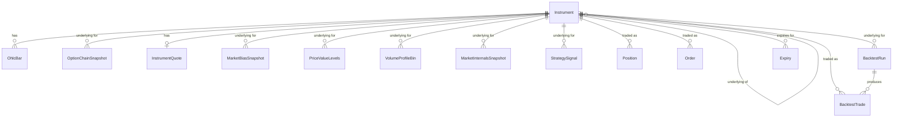

# NiftyEdge — Database Design

Target engine: **SQL Server, local instance** (Express or Developer edition — see
[Engine notes](#engine-notes) below). No models/migrations exist yet; this is the
schema to build against for Story 1+ (live price engine, option chain, strategy
signals, positions, backtester).

Design driven directly off the current dashboard mockup: top ticker bar, Market
Bias (AI) banner, Price vs Value / OI Walls / Market Internals / Volatility
panels, the main chart with Volume Profile + CVD, Strategy Signal panel, Option
Chain / Greeks / Risk / Positions panels.

## Engine notes

- Use **SQL Server Express or Developer edition** installed as a normal Windows
  service, not **LocalDB**. LocalDB spins an instance up per user session on
  first connection and shuts it down when idle — fine for a desktop app opened
  by a human, wrong fit for a FastAPI backend that needs an always-on
  connection pool and a background tick-ingestion loop. Express is free and
  has no practical size limit for this workload (10 GB/database cap, and
  we're nowhere near that — see [retention](#retention--downsampling)).
- Connect from Python via `pyodbc` + SQLAlchemy (`mssql+pyodbc`), Windows Auth
  (`Trusted_Connection=yes`) since it's a single local machine — avoids
  storing DB credentials alongside the Dhan token in `.env`.
- Columnstore indexes (available in Express/Standard since SQL Server 2016
  SP1) are the key tool for the two high-volume tables (`OhlcBar`,
  `OptionChainSnapshot`) — see [Indexing](#indexing-strategy).

## Schema organization

Four SQL Server schemas, grouped by lifecycle rather than dumping everything
in `dbo`:

| Schema | Purpose |
|---|---|
| `market` | Instrument reference data + raw/derived market data (bars, option chain, live quotes) |
| `analytics` | Computed/cached values the dashboard reads directly (bias, value levels, signals) |
| `portfolio` | Broker-mirrored state (positions, orders, risk) — **read-only mirror**, per the README's "analytics-only, no order placement" stance |
| `backtest` | Backtester runs and trade legs |
| `app` | App-level settings, not secrets (those stay in `.env`) |

## Tables

### `market.Instrument`
Security master, refreshed from Dhan's scrip master CSV (`instruments.py`).

| Column | Type | Notes |
|---|---|---|
| SecurityId | INT | **PK.** Dhan's numeric security ID |
| Exchange | VARCHAR(10) | NSE, BSE, ... |
| Segment | VARCHAR(10) | IDX, EQ, FNO |
| InstrumentType | VARCHAR(10) | INDEX, EQUITY, FUTIDX, OPTIDX, FUTSTK, OPTSTK |
| Symbol | VARCHAR(30) | e.g. NIFTY, NIFTY24JUL23600CE |
| DisplayName | NVARCHAR(100) | |
| UnderlyingSecurityId | INT NULL | **FK → market.Instrument.SecurityId** (self-ref). Null for the index/equity itself |
| ExpiryDate | DATE NULL | Derivatives only |
| StrikePrice | DECIMAL(12,4) NULL | Options only |
| OptionType | CHAR(2) NULL | CE / PE |
| LotSize | INT NULL | |
| TickSize | DECIMAL(6,4) NULL | |
| IsActive | BIT | False once expired/delisted |
| LastSyncedAt | DATETIME2(0) | |

### `market.Expiry`
Materialized expiry list per underlying, for the Expiry dropdown (avoids a
`DISTINCT` scan over `Instrument` on every page load).

| Column | Type | Notes |
|---|---|---|
| UnderlyingSecurityId | INT | **FK → market.Instrument** |
| ExpiryDate | DATE | |
| ExpiryType | VARCHAR(10) | WEEKLY / MONTHLY |
| IsFrontWeek | BIT | Flags the default-selected expiry |
| **PK** | (UnderlyingSecurityId, ExpiryDate) | |

### `market.OhlcBar`
Candle data behind the main chart, at every timeframe the app supports.

| Column | Type | Notes |
|---|---|---|
| SecurityId | INT | **FK → market.Instrument** |
| Timeframe | VARCHAR(4) | 1m, 5m, 15m, 1d |
| BarTime | DATETIME2(0) | Bar open time |
| Open, High, Low, Close | DECIMAL(12,4) | |
| Volume | BIGINT | |
| OpenInterest | BIGINT NULL | Futures only |
| CumulativeDelta | BIGINT NULL | Running CVD value at this bar — feeds the CVD sub-chart directly, no separate table |
| **PK** | (SecurityId, Timeframe, BarTime) | |

### `market.OptionChainSnapshot`
The big one — a full snapshot of the option chain for one underlying+expiry
at one point in time. Feeds Option Chain Snapshot, OI Walls, Greeks, and (via
aggregation) PCR/straddle.

| Column | Type | Notes |
|---|---|---|
| UnderlyingSecurityId | INT | **FK → market.Instrument** |
| ExpiryDate | DATE | |
| SnapshotTime | DATETIME2(0) | |
| StrikePrice | DECIMAL(12,4) | |
| OptionType | CHAR(2) | CE / PE |
| Ltp | DECIMAL(12,4) | |
| BidPrice, AskPrice | DECIMAL(12,4) | |
| Volume | BIGINT | |
| OpenInterest | BIGINT | |
| OiChange | BIGINT | |
| ImpliedVolatility | DECIMAL(6,3) | |
| Delta, Gamma, Theta, Vega, Rho | DECIMAL(10,5) | |
| OiBias | VARCHAR(6) NULL | BUYER / SELLER classification shown per row |
| **PK** | (UnderlyingSecurityId, ExpiryDate, SnapshotTime, StrikePrice, OptionType) | |

### `market.InstrumentQuote`
Hot cache of the *latest* price/OI per instrument — upserted on every tick.
Backs the top ticker bar and gives Positions/Orders a live LTP without
scanning history.

| Column | Type | Notes |
|---|---|---|
| SecurityId | INT | **PK, FK → market.Instrument** |
| Ltp | DECIMAL(12,4) | |
| PrevClose | DECIMAL(12,4) | |
| Change, ChangePct | DECIMAL(10,4) | |
| Volume | BIGINT NULL | |
| OpenInterest | BIGINT NULL | |
| UpdatedAt | DATETIME2(3) | |

### `analytics.MarketBiasSnapshot`
The red "MARKET BIAS (AI)" banner.

| Column | Type | Notes |
|---|---|---|
| Id | BIGINT IDENTITY | PK |
| UnderlyingSecurityId | INT | **FK → market.Instrument** |
| SnapshotTime | DATETIME2(0) | |
| Bias | VARCHAR(10) | BULLISH / BEARISH / NEUTRAL |
| VahLevel | DECIMAL(12,4) | |
| ConfidencePct | DECIMAL(5,2) | |
| PriceVsValue | VARCHAR(20) | "Below VAH" etc. |
| OrderFlow | VARCHAR(20) | "Selling Pressure" etc. |
| OiTrend | VARCHAR(20) | "CE Writing" etc. |
| DeltaBias | VARCHAR(10) | Positive / Negative |
| GammaBias | VARCHAR(10) | Positive / Negative |

### `analytics.PriceValueLevels`
One row per underlying per session — VAH/POC/VAL/Pivot/R1/S1 panel.

| Column | Type | Notes |
|---|---|---|
| UnderlyingSecurityId | INT | **FK → market.Instrument** |
| TradeDate | DATE | |
| Vah, Poc, Val, Pivot, R1, S1 | DECIMAL(12,4) | |
| CurrentPrice | DECIMAL(12,4) | |
| PositionVsVah | VARCHAR(10) | ABOVE / BELOW |
| **PK** | (UnderlyingSecurityId, TradeDate) | |

### `analytics.VolumeProfileBin`
Feeds the volume-profile histogram beside the chart.

| Column | Type | Notes |
|---|---|---|
| UnderlyingSecurityId | INT | **FK → market.Instrument** |
| TradeDate | DATE | |
| PriceBinLow, PriceBinHigh | DECIMAL(12,4) | |
| Volume | BIGINT | |
| IsPoc | BIT | |
| **PK** | (UnderlyingSecurityId, TradeDate, PriceBinLow) | |

### `analytics.MarketInternalsSnapshot`
Advance/decline, CVD total, straddle, IV rank/percentile, PCR.

| Column | Type | Notes |
|---|---|---|
| Id | BIGINT IDENTITY | PK |
| UnderlyingSecurityId | INT | **FK → market.Instrument** |
| SnapshotTime | DATETIME2(0) | |
| Advances, Declines | INT | |
| AdRatio | DECIMAL(6,3) | |
| NewHigh, NewLow | INT | |
| CumulativeDelta | BIGINT | |
| StraddlePremium | DECIMAL(12,4) | |
| AtmIv | DECIMAL(6,3) | |
| IvRank, IvPercentile | DECIMAL(5,2) | |
| PcrOi | DECIMAL(6,3) | Bullish/Bearish label is a display-layer threshold on this value, not stored |

### `analytics.StrategySignal`
Strategy Signal panel (primary + alternative setups).

| Column | Type | Notes |
|---|---|---|
| SignalId | BIGINT IDENTITY | PK |
| UnderlyingSecurityId | INT | **FK → market.Instrument** |
| ExpiryDate | DATE | |
| GeneratedAt | DATETIME2(0) | |
| SignalType | VARCHAR(20) | SELL_CALL, BUY_PUT, SELL_PUT, BUY_CALL, ... |
| IsPrimary | BIT | Primary vs. Alternative setup |
| ConfidencePct | DECIMAL(5,2) | |
| TriggerCondition | NVARCHAR(100) NULL | e.g. "If 23,400 breaks" — null for the primary (already active) signal |
| EntryZoneLow, EntryZoneHigh | DECIMAL(12,4) NULL | |
| Target, StopLoss | DECIMAL(12,4) NULL | |
| ReasonsJson | NVARCHAR(MAX) | JSON array of the bullet-point reasons ("Price below VAH & POC", ...). Native SQL Server JSON functions (`JSON_VALUE`, `OPENJSON`) can query into it if ever needed; a child table isn't worth it for a short display-only list |
| Status | VARCHAR(12) | ACTIVE / HIT_TARGET / HIT_STOP / EXPIRED / CANCELLED |
| ClosedAt | DATETIME2(0) NULL | |

### `portfolio.Position`
Mirrors the broker's open positions (Dhan) — **not the source of truth**, just
a synced read cache for display/history, consistent with the "analytics-only,
no order-placement code" stance in the README.

| Column | Type | Notes |
|---|---|---|
| PositionId | BIGINT IDENTITY | PK |
| SecurityId | INT | **FK → market.Instrument** |
| Quantity | INT | Signed: negative = short (matches the -75 shown in the mockup) |
| AvgPrice | DECIMAL(12,4) | |
| Pnl | DECIMAL(14,2) | |
| PnlPct | DECIMAL(8,4) | |
| Status | VARCHAR(10) | OPEN / CLOSED |
| OpenedAt | DATETIME2(0) | |
| ClosedAt | DATETIME2(0) NULL | |
| SyncedAt | DATETIME2(0) | Last time this row was refreshed from the broker |

*(LTP for the Positions table is read live from `market.InstrumentQuote`, not
duplicated here.)*

### `portfolio.Order`
Read-mirror of the broker's order book, for the Orders nav item — populated
by polling, not by this app placing orders.

| Column | Type | Notes |
|---|---|---|
| BrokerOrderId | VARCHAR(30) | **PK** — Dhan's own order ID |
| SecurityId | INT | **FK → market.Instrument** |
| Side | VARCHAR(4) | BUY / SELL |
| OrderType | VARCHAR(10) | MARKET / LIMIT / SL / SL-M |
| Quantity | INT | |
| Price | DECIMAL(12,4) NULL | |
| Status | VARCHAR(12) | PENDING / FILLED / CANCELLED / REJECTED |
| PlacedAt, UpdatedAt | DATETIME2(0) | |

### `portfolio.RiskSnapshot`
Portfolio-level Risk & Position Summary panel, kept as a time series so the
P&L sparkline can render.

| Column | Type | Notes |
|---|---|---|
| SnapshotTime | DATETIME2(0) | **PK** |
| NetDelta, NetGamma | DECIMAL(10,4) | |
| NetTheta, NetVega | DECIMAL(12,4) | |
| MarginUsed, MarginAvailable | DECIMAL(14,2) | |
| ExposurePct | DECIMAL(5,2) | |
| PnlToday | DECIMAL(14,2) | |

### `backtest.BacktestRun`

| Column | Type | Notes |
|---|---|---|
| BacktestRunId | BIGINT IDENTITY | PK |
| StrategyName | VARCHAR(50) | |
| ParamsJson | NVARCHAR(MAX) | Strategy config as submitted |
| UnderlyingSecurityId | INT | **FK → market.Instrument** |
| StartDate, EndDate | DATE | |
| CreatedAt | DATETIME2(0) | |
| Status | VARCHAR(12) | RUNNING / COMPLETED / FAILED |
| TotalTrades | INT NULL | |
| WinRate | DECIMAL(5,2) NULL | |
| TotalPnl | DECIMAL(14,2) NULL | |
| MaxDrawdown | DECIMAL(14,2) NULL | |
| SharpeRatio | DECIMAL(6,3) NULL | |

### `backtest.BacktestTrade`

| Column | Type | Notes |
|---|---|---|
| BacktestTradeId | BIGINT IDENTITY | PK |
| BacktestRunId | BIGINT | **FK → backtest.BacktestRun** |
| SecurityId | INT | **FK → market.Instrument** |
| Side | VARCHAR(4) | BUY / SELL |
| EntryTime, ExitTime | DATETIME2(0) | |
| EntryPrice, ExitPrice | DECIMAL(12,4) | |
| Quantity | INT | |
| Pnl | DECIMAL(14,2) | |
| ExitReason | VARCHAR(10) | TARGET / STOP / EXPIRY / MANUAL |

### `app.AppSetting`
Generic key-value for UI/behavior preferences. Credentials never go here —
those stay in `backend/.env` per the existing security note.

| Column | Type | Notes |
|---|---|---|
| SettingKey | VARCHAR(50) | **PK** |
| SettingValue | NVARCHAR(200) | |
| UpdatedAt | DATETIME2(0) | |

**Out of scope for now** (flagging, not designing): watchlists and
price/OI/IV alert rules aren't on the current screen — add
`app.Watchlist`/`app.AlertRule` tables later if those features get built,
rather than speculatively including them here.

## Relationships (ERD)

## Indexing strategy

- **`market.OhlcBar`** and **`market.OptionChainSnapshot`** are the volume
  drivers (option chain snapshots especially: ~40 strikes × 2 sides, snapshotted
  every 15–30s through a 6.25hr session ≈ 60k+ rows/day per underlying). Put a
  **clustered columnstore index** on both instead of a traditional clustered
  rowstore index — dramatically better compression and scan speed for the
  append-only, aggregate-heavy queries the dashboard and backtester run
  (`SUM(OpenInterest) GROUP BY StrikePrice`, OHLC range scans, etc.).
- **`market.InstrumentQuote`** and **`analytics.PriceValueLevels`** stay small
  (one row per instrument / per instrument-per-day) — ordinary clustered PK,
  no columnstore needed.
- Add a nonclustered index on `OptionChainSnapshot(UnderlyingSecurityId,
  ExpiryDate, SnapshotTime DESC)` to make "give me the latest full chain"
  (the dashboard's actual hot path) fast even with columnstore as the base.

## Retention & downsampling

`OptionChainSnapshot` is the table that will grow unbounded if left alone.
Recommended policy, run as a nightly SQL Agent job (or a scheduled task if
Agent isn't available on Express):

1. Keep full-resolution (15–30s) snapshots for a rolling **60-day** window.
2. Beyond 60 days, collapse to **5-minute** resolution (keep one row per
   strike/side per 5-min bucket, e.g. the last snapshot in each bucket) and
   delete the rest.
3. Beyond **2 years**, drop entirely or archive to a flat file if historical
   option-chain backtesting that far back isn't needed.

`OhlcBar` at 1-minute resolution is much lighter (5 instruments × ~375
bars/day) and can be kept indefinitely without a downsampling job.

## Notes on scope

Everything in `portfolio` is explicitly a **read-only mirror** of broker
state — matching the README's "this tool is analytics-only, no order
placement code" — the schema doesn't assume this app originates trades. If
that changes later, `portfolio.Order` becomes a real order-submission log
instead of a polling mirror, and would need status-transition auditing
(SQL Server **temporal tables** — `SYSTEM_VERSIONING = ON` — are a natural
fit for that later, not needed today).
